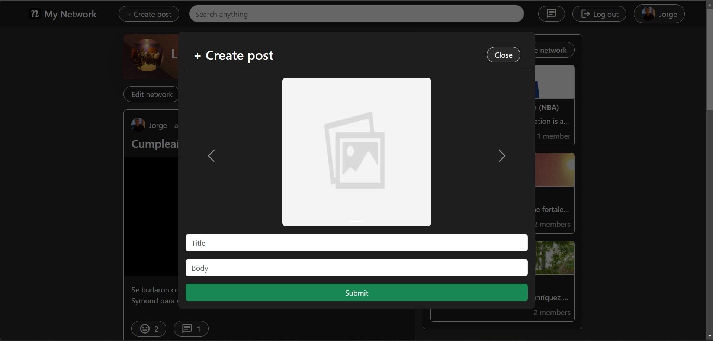

#### Funcionalidades

Detalles en mi [portafolio](https://jorgelorenzom.vercel.app/my-network/)

---

##### Crear red

Permite crear redes que están separadas a las otras.
En las redes hay administradores y miembros. Las publicaciones se agrupan por redes. La red tiene una foto de pérfil,
portada, nombre y descripción.

##### Crear post

Permite publicar publicaciones, estas se agrupan por red.
Se pueden publicar textos, fotos o videos, o un conjunto entre estos tres.

##### Chatear

Soporta mensajes directos a otros usuarios en tiempo real, logrado
usando websockets implementados con Socket.io.

##### Comentar

Comenta publicaciones.

##### Video

Permite publicar videos.

#### Aceptar miembros a la red

Los administradores de la red pueden aceptar solicitudes
de unirse a su red.

#### Borrar y editar red

Edita el nombre, la descripción, la foto de pérfil o la portadad de la red.
